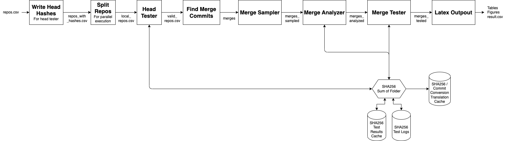

# Evaluation of VCS merging algorithms


## Requirements

### Download the cached data

Download the compressed cached data [here](https://zenodo.org/records/13366866) and put it in the root directory of the project. Be aware the the uncompressed cache size is 84GB as of 09-23-2024.

### Python

To install all the Python requirements, create a conda or mamba environment:

With conda:

```bash
conda env create -f environment.yml
conda activate AST
```

With mamba (faster https://github.com/mamba-org/mamba):

```bash
mamba env create -f environment.yml
mamba activate AST
```

### Maven

You must use Maven version 3.9.*.

### Ubuntu

```bash
sudo apt-get install -y jq
command -v curl >/dev/null || sudo apt install curl -y
curl -fsSL https://cli.github.com/packages/githubcli-archive-keyring.gpg | sudo dd of=/usr/share/keyrings/githubcli-archive-keyring.gpg \
&& sudo chmod go+r /usr/share/keyrings/githubcli-archive-keyring.gpg \
&& echo "deb [arch=$(dpkg --print-architecture) signed-by=/usr/share/keyrings/githubcli-archive-keyring.gpg] https://cli.github.com/packages stable main" | sudo tee /etc/apt/sources.list.d/github-cli.list > /dev/null \
&& sudo apt update \
&& sudo apt install gh -y
curl -s https://packagecloud.io/install/repositories/github/git-lfs/script.deb.sh | sudo bash
```

### MacOS

```bash
brew install jq
brew install gh
```

### Java

You must install Java 8, 11 and 17. You must set the `JAVA8_HOME`, `JAVA11_HOME` and `JAVA17_HOME` environment variables to the respective Java installations.

---

## Run the code

### Test the stack

To test the stack, execute:

```bash
make small-test
```

This runs the entire code on two small repos.
The output data appears in `results/small/`.

* `results/small/result.csv`: the final result

* `results/small/merges/` contains all the merges.

* `results/small/merges_compared/` contains all merges and indicates whether the merge results are different and thus need to be analyzed.

* `results/small/merges_tested/` contains all merges that have been tested.

* `results/small/result.csv` contains the final result.

### Perform full analysis

To run the stack on all repos:

```bash
./run_combined.sh
```

To run the stack on all repos and also diff the merges' outputs:

```bash
./run_combined.sh -d
```

This will run the entire code on all the repos and automatically decompress the cache if `cache/` does not exist.
All the output data can be found in `results/`.
The final result is found in `results/result.csv`.
Directory `results/merges` contains all the merges for each repo.
Directory `results/merges_tested` contains all the merges that have been tested.

To execute `run_combined.sh` on multiple machines in parallel create a machine address list in `machines.txt` and run:

```bash
./src/scripts/utils/run_multiple_machines.sh main machines.txt <project_path_on_machine>
```

#### If `make small-test` fails

If `make small-test` fails in a branch that you wish to merge into the main
branch, run `make small-test` in the main branch (which should succeed) and also
in your branch, and investigate the differences.

#### Updating the goal files

If you make a change to the mergers that changes merge results, you need to
update the goal files or else reproducibility checks will fail.
Copy certain files from `results/small/` to `test/small-goal-files/`.

To update the reproducibility tests, run `make run-all`
(this takes a long time!) and commit the results.
This will run merges in parallel.  If the load on your machine becomes very low
(like no parallelism is happening), then terminate the process and restart it.

### Load the stored cache

To decompress the cache run `make decompress-cache`. This is done automatically in `run_combined.sh` if `cache/` does not exist.

### Store the cache

To store the cache `make compress-cache`.

### Clean Cache

To clean the cache run `make clean-cache`.

### Clean Workspace

To cleanup the workspace:`make clean`

### Style Checking

To run style checking run `make style`.

---

## Code structure



## Directory structure

### Committed files

* run.sh -> This file executes each step of the stack.

* run_small.sh -> This file executes the stack on two repositories.

* run_combined.sh -> This file executes the stack on all the repositories.

* run_greatest_hits.sh -> This file executes the stack on the greatest hits repositories.

* run_reaper.sh -> This file executes the stack on the reaper repositories.

* run_1000.sh -> This file executes the stack on the 1000 repositories.

* src/ -> contains the following scripts:

  * python/ -> contains the following scripts:

    * merge_tester.py -> Main file which performs merges and evaluates all the results across all projects.

    * test_repo_heads.py -> Checks out all repos and removes all repos that fail their tests on main branch.

    * latex_output.py -> Output latex code for the resulting plots and table.

    * merge_analyzer.py -> Analyzes a merge to determine if it should be tested.

    * merges_sampler.py -> Samples merges to be tested.

    * get_repos.py -> Downloads the repos list.

    * cache_utils.py -> Contains functions to store and load the cache.

    * clean_cache_placeholders.py -> Removes all the cache placeholders.

    * repo.py -> Contains the Repo class which represents a repo.

    * split_repos.py -> Splits the repos for parallel execution.

    * write_head_hashes.py -> Writes the head hashes of all repos to a file.

    * add_jacoco_gradle.py -> Adds jacoco to gradle projects.

    * add_jacoco_maven.py -> Adds jacoco to maven projects.

  * scripts/ -> contains the following scripts:

    * run_repo_tests.sh -> Runs a repo's programmer provided tests.

    * merge_tools/ -> Contains all the merge tools scripts.

    * utils/

      * run_remotely.sh -> Runs the full stack on a remote machine.

      * run_multiple_machine.sh -> Runs the full stack on multiple remote machines.

      * diff_statistics.py -> Various diff commands to compare the results of two merges.

  * src/main/java/astmergeevaluation/FindMergeCommits.java -> Finds all merge commits in a repo.

* input_data/ -> Input data, which is a list of repositories; see its README.md.

### Uncommitted Files

* cache/ -> This folder is a cache for each computation. contains:

  * test_result/ -> Caches the test results for a specific commit. Used for parent testing and repo validation.

  * merge_test_results/ -> Caches the test results for specific merges. Used for merge testing. First line indicates the merge result, second line indicates the run time.

  * merge_diff_results/ -> Caches the diff results for specific merges.

* cache-small/ -> This folder is a cache for each test computation. contains:

  * test_result/ -> Caches the test results for a specific commit. Used for parent testing and repo validation.

  * merge_test_results/ -> Caches the test results for specific merges. Used for merge testing. First line indicates the merge result, second line indicates the run time.

* .workdir/ -> This folder is used for the local computations of each process and content is named by Unix process (using "$$"). If `DELETE_WORKDIRS` is set to `false` in `src/python/variables.py` this folder is not deleted after the computation and can be inspected.

* repos/ -> In this folder each repo is cloned.

* results/ -> Contains all the results for the full analysis.

* results/small/ -> Contains all the results for the small analysis.

* jars/ -> Location for the IntelliMerge and Spork jars.

## Comparing merge algorithms

To investigate differences between two mergers:

* edit file `src/python/utils/select_from_results.py` to reflect the differences you are interested in.
* run `src/python/utils/select_from_results.py` to create a .csv database containing only the differences.
* Set `DELETE_WORKDIRS` to `false` in `src/python/variables.py`.
* run `src/python/replay_merge.py --idx INDEX` (maybe add `-test`) for the index of the merge you are interested in.
  If the merge is in the small test, you may need to add `--merges_csv ./test/small-goal-files/result.csv`.

## Overwriting results manually

In some cases it might be worth to overwrite the computed results. To do that you should modify the `results/manual_override.csv` file. In that file for the merge you want to overwrite a result of you should include at least the information `repository,merge,left,right` and a new column for the result you want to overwrite. You can overwrite anything you want but if there is a column you don't want to overwrite either do not include that column or leave the entry blanck i.e. `,,`. See the file for an example.
